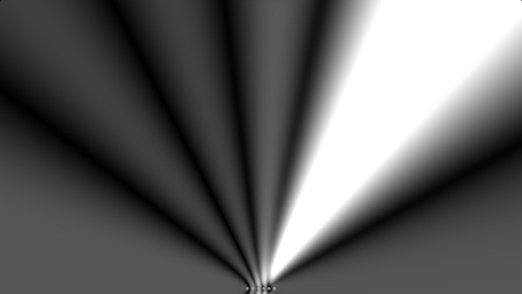

# Phased Array Simulation
## How to Run
1. Clone the Repo
2. Go to the Shadertoy Phased Array Simulator online tool - https://www.shadertoy.com/view/NdXfDl
3. Use this code in the window to the right of the Phased array Image to see the output

## Output
The output should look like this:
